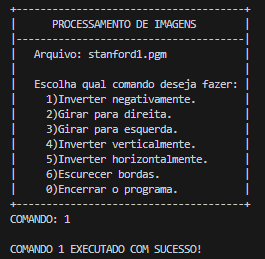

# ManipulacaoDeImagem

Trabalho prático da disciplina de Algoritmos e Estrutura de dados(AEDS 2) sobre manipulação de imagens e aritmética de ponteiros.

## Objetivo

Fazer a manipulação de imagens em tons de cinza(.pgm) utilizando algoritmos de ponteiros. As operações feitas no programa são:

- Inverter Negativamente
- Girar para esquerda e direita
- Inverter horizontalmente e verticalmente
- Escurecer bordas

## Requisitos

- gcc instalado

## Como executar

1. Compile os arquivos .cc
```
    gcc -o main main.cc funcoes.cc
```

2. Execute com o seguinte comando:
```
    ./main
```

## Exemplo

### Menu de comandos:




### Imagem original


### Resultado da operação (1)

